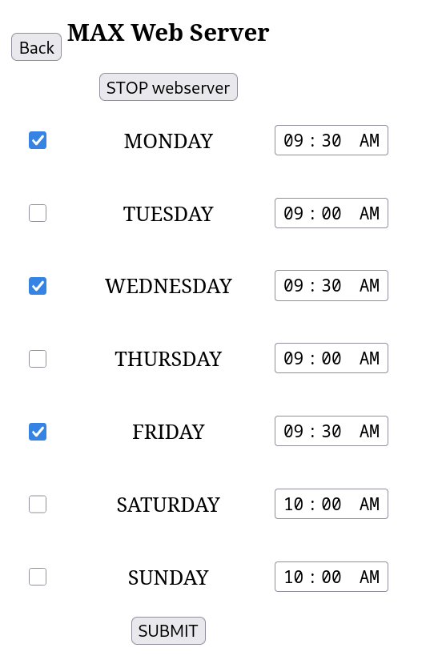
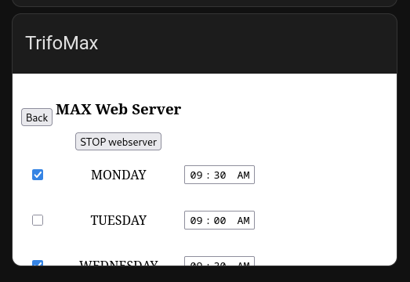

# trifo-max-ha
This repo contains the software that can be run on a trifo max to create a webpage on it (Do this on your own risk!)




# How to install

- have docker installed

- run build.sh (warning: this can take a good while on non-arm64 machines.)

- move trifomaxha.py-aarch64 to trifo max to /root/trifomaxha.py-aarch64

```
scp ./trifomaxha.py-aarch64 root@[robotip]:/root/
```

- run trifomaxha.py-aarch64 on trifomax


# Integration with home assistant (work in progress)
- embed this created domain in home assistant using a Webpage Card with the following url:
```
https://YOURTRIFOMAXIPHERE/settings?password=YOURPASSWORDHERE
```
The password can be found in the trifomax_env.json file (and can also be changed)

