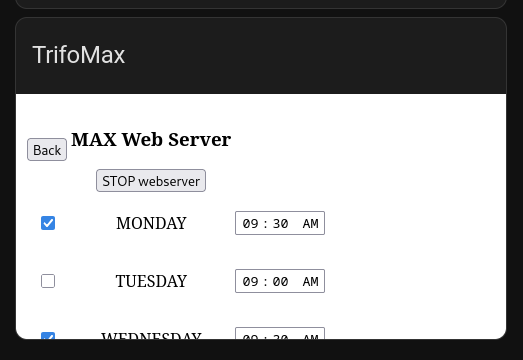

# trifo-max-ha
This repo contains the software that can be run on a trifo max to create a webpage on it (Do this on your own risk!)


# How to install

- have docker installed

- run build.sh

- move trifomaxha.py-aarch64 to trifo max to /root/trifomaxha.py-aarch64

```
scp ./trifomaxha.py-aarch64 root@[robotip]:/root/
```

- run trifomaxha.py-aarch64 on trifomax


# Integration with home assistant (work in progress)

- create a reverse proxy to the trifo max webpage (because homeassistant over https cannot embed an http page)

- embed this created domain in home assistant

